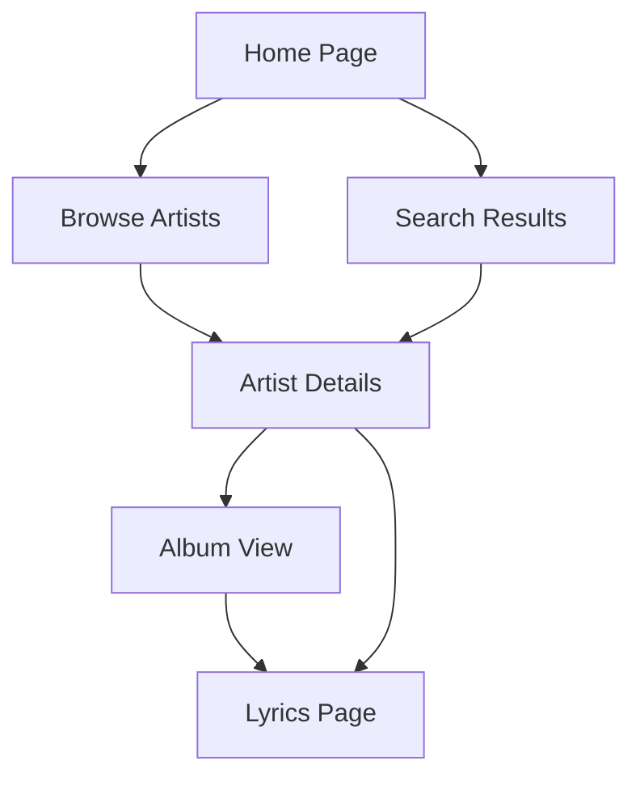

## 1. Product Overview
52lyrics is a modern music lyrics website that provides users with access to song lyrics, artist information, and album details. The platform serves music enthusiasts who want to explore lyrics, discover artists, and browse music collections in an elegant dark-themed interface.

The product solves the problem of finding accurate lyrics and music information in a visually appealing, easy-to-navigate platform. Target users include music lovers, karaoke enthusiasts, and anyone seeking to explore song meanings and artist discographies.

## 2. Core Features

### 2.1 User Roles
| Role | Registration Method | Core Permissions |
|------|---------------------|------------------|
| Guest User | No registration required | Browse lyrics, search songs/artists, view charts |
| Registered User | Email registration | Save favorites, submit lyrics, share content |

### 2.2 Feature Module
Our music lyrics website consists of the following main pages:
1. **Home page**: hero section, search functionality, popular artists showcase, popular albums grid, hot songs sidebar
2. **Browse Artists page**: alphabetical filtering, artist cards with song counts, search functionality
3. **Artist Details page**: artist biography, discography with albums/singles tabs, track listings
4. **Lyrics page**: full song lyrics display, album information, additional tracks from same album

### 2.3 Page Details
| Page Name | Module Name | Feature description |
|-----------|-------------|---------------------|
| Home page | Header navigation | Logo display, main navigation links (Home, Top Charts), search bar with placeholder text |
| Home page | Hero section | Featured content card with badges (FEATURED, NEW RELEASE), title, description, CTA button |
| Home page | A-Z pagination | Alphabetical navigation chips for quick artist browsing |
| Home page | Popular Artists | Artist showcase with circular thumbnails, names, and genre tags |
| Home page | Popular Albums | Album grid display with cover images, titles, and artist/year information |
| Home page | Hot Songs | Top 5 songs ranking with play icons and "View Top 100" link |
| Browse Artists | Header | Consistent branding with artist-specific search bar |
| Browse Artists | Filter chips | Alphabetical filtering (All, A-Z) with active state highlighting |
| Browse Artists | Artist cards | Artist name display with song count, organized alphabetically |
| Browse Artists | Empty state | No results message with search suggestion for unavailable letters |
| Browse Artists | Load More | Pagination button to load additional artists |
| Artist Details | Breadcrumb | Navigation trail showing current location (Home / Artists / Artist Name) |
| Artist Details | Artist header | Artist name, genre, active years, location, description, and follow button |
| Artist Details | Discography tabs | Albums and Singles toggle with active state |
| Artist Details | Album cards | Album artwork, title, release info, track listings with view buttons |
| Lyrics page | Breadcrumb | Full navigation path (Home / Artist / Album / Song) |
| Lyrics page | Song info | Title, artist, album, genre tags, play button, save/share actions |
| Lyrics page | Lyrics display | Formatted lyrics with section headers [Intro], [Verse], [Chorus], etc. |
| Lyrics page | Copy functionality | Copy text button for lyrics content |
| Lyrics page | More tracks | Additional songs from same album with duration |
| Lyrics page | Credits | Songwriters and copyright information |
| Footer | Site links | About Us, Privacy Policy, Terms of Service, Copyright information |

## 3. Core Process

### Guest User Flow
1. User lands on homepage and sees featured content, popular artists, and hot songs
2. User can search for specific songs, artists, or albums using the search bar
3. User browses artists alphabetically or views all artists
4. User clicks on an artist to view their discography and biography
5. User selects a song to view full lyrics with formatting and credits
6. User can navigate between different songs from the same album

### Search Flow
1. User enters search query in any page's search bar
2. System displays relevant results for songs, artists, or albums
3. User clicks on desired result to navigate to specific content

## 4. User Interface Design

### 4.1 Design Style
- **Primary colors**: Dark navy/black background (#0F172A or similar)
- **Secondary colors**: Blue accents (#3B82F6), white text, gray secondary text
- **Button style**: Rounded corners (8-12px radius), blue primary buttons with white text
- **Typography**: Clean sans-serif fonts, hierarchical sizing from small (12px) to large (32px+)
- **Layout**: Card-based design with consistent spacing (8-24px rhythm)
- **Icons**: Minimalist line icons, music notes, play arrows, heart for favorites

### 4.2 Page Design Overview
| Page Name | Module Name | UI Elements |
|-----------|-------------|-------------|
| Home page | Header | White "52lyrics" logo with music note icon, dark navigation bar, rounded search input |
| Home page | Hero section | Large feature card with gradient overlay, blue and white badges, prominent CTA button |
| Home page | Artist showcase | Circular artist photos, bold white names, small gray genre tags, 6-column grid |
| Home page | Album grid | Square album covers, white titles, gray artist/year text, 6-column responsive grid |
| Browse Artists | Filter bar | Pill-shaped chips with blue active state, smooth hover transitions |
| Artist Details | Artist card | Large rounded container, follow button aligned right, social icons |
| Artist Details | Album cards | Horizontal layout with cover art, track table with alternating row colors |
| Lyrics page | Two-column layout | Left: song info and actions, Right: full lyrics with generous line height |
| Lyrics page | Lyrics formatting | Blue section headers [Verse 1], white lyrics text, proper line breaks preserved |

### 4.3 Responsiveness
- **Desktop-first approach**: Optimized for 1920x1080 and 1440x900 resolutions
- **Breakpoints**: Tablet (768px), Mobile (375px) with appropriate content reflow
- **Touch optimization**: Larger tap targets on mobile, swipe gestures for navigation

### 4.4 Visual Consistency
- **Border radius**: 8px for buttons, 12px for cards, 50% for circular elements
- **Shadows**: Subtle drop shadows on cards, hover states with increased elevation
- **Transitions**: Smooth 200ms transitions for hover states and interactions
- **Spacing**: 8px base unit, consistent margins and padding throughout