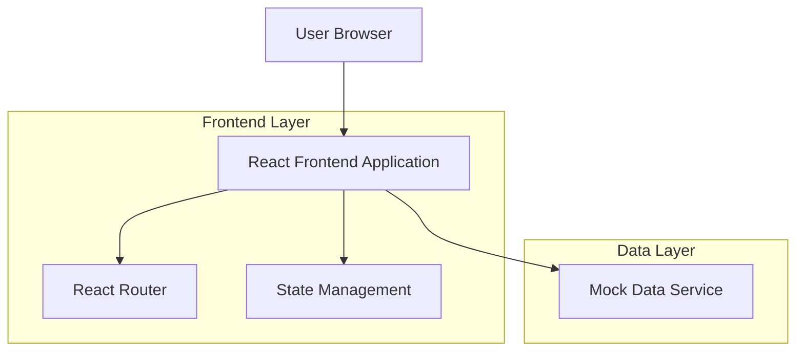

## 1. Architecture Design



## 2. Technology Description

- **Frontend**: React@18 + Tailwind CSS@3 + Vite
- **Initialization Tool**: vite-init
- **Routing**: React Router@6
- **State Management**: React Context API + useState/useEffect
- **Backend**: None (Frontend-only with mock data)
- **Build Tool**: Vite for development and production builds

## 3. Route Definitions

| Route | Purpose |
|-------|---------|
| / | Home page with featured content, popular artists, albums, and hot songs |
| /artists | Browse artists with alphabetical filtering and search functionality |
| /artists/:artistId | Artist details page with biography and discography |
| /albums/:albumId | Album details with track listings |
| /lyrics/:songId | Full lyrics display with song information and credits |
| /search | Search results page for songs, artists, and albums |
| /top-charts | Top 100 songs chart display |

## 4. Component Architecture

### 4.1 Core Components

**Layout Components**
```typescript
interface HeaderProps {
  currentPage?: string;
  searchPlaceholder?: string;
}

interface FooterProps {
  showCopyright?: boolean;
}
```

**Artist Components**
```typescript
interface ArtistCardProps {
  id: string;
  name: string;
  songCount: number;
  imageUrl?: string;
  genres?: string[];
}

interface ArtistDetailsProps {
  artistId: string;
}
```

**Album Components**
```typescript
interface AlbumCardProps {
  id: string;
  title: string;
  artist: string;
  year: number;
  coverUrl?: string;
  trackCount?: number;
}

interface TrackListProps {
  tracks: Track[];
  showLyricsLinks?: boolean;
}
```

**Lyrics Components**
```typescript
interface LyricsDisplayProps {
  songId: string;
  lyrics: string;
  sections: LyricSection[];
}

interface LyricSection {
  type: 'intro' | 'verse' | 'chorus' | 'bridge' | 'outro';
  number?: number;
  content: string[];
}
```

### 4.2 Mock Data Structure

**Artist Data**
```typescript
interface Artist {
  id: string;
  name: string;
  genres: string[];
  activeYears: string;
  location: string;
  biography: string;
  songCount: number;
  imageUrl?: string;
  albums: Album[];
}
```

**Album Data**
```typescript
interface Album {
  id: string;
  title: string;
  artistId: string;
  releaseDate: string;
  year: number;
  trackCount: number;
  coverUrl?: string;
  tracks: Track[];
}
```

**Song/Lyrics Data**
```typescript
interface Song {
  id: string;
  title: string;
  artistId: string;
  albumId: string;
  duration: string;
  trackNumber: number;
  lyrics: string;
  sections: LyricSection[];
  writers: string[];
  copyright: string;
}
```

## 5. State Management

### 5.1 Global State
```typescript
interface AppState {
  searchQuery: string;
  currentArtist: Artist | null;
  currentAlbum: Album | null;
  currentSong: Song | null;
  favorites: string[]; // song IDs
  recentlyViewed: string[]; // song IDs
}
```

### 5.2 Context Providers
- **SearchContext**: Global search functionality
- **FavoritesContext**: User's favorite songs management
- **NavigationContext**: Breadcrumb and navigation state

## 6. Styling Implementation

### 6.1 Tailwind Configuration
```javascript
// tailwind.config.js
module.exports = {
  theme: {
    extend: {
      colors: {
        primary: {
          50: '#eff6ff',
          500: '#3b82f6',
          600: '#2563eb',
          900: '#1e3a8a',
        },
        dark: {
          800: '#1f2937',
          900: '#111827',
          950: '#030712'
        }
      },
      spacing: {
        '18': '4.5rem',
        '88': '22rem'
      }
    }
  }
}
```

### 6.2 CSS Custom Properties
```css
:root {
  --color-background: #030712;
  --color-surface: #1f2937;
  --color-primary: #3b82f6;
  --color-text-primary: #ffffff;
  --color-text-secondary: #9ca3af;
  --border-radius: 0.5rem;
  --spacing-unit: 0.5rem;
}
```

## 7. Performance Optimization

### 7.1 Code Splitting
- Route-based code splitting using React.lazy()
- Component-level splitting for heavy components (LyricsDisplay, ArtistDetails)

### 7.2 Image Optimization
- Use of placeholder images for album covers and artist photos
- Lazy loading for image-heavy sections
- WebP format support with fallbacks

### 7.3 Caching Strategy
- LocalStorage for favorites and recently viewed items
- Session storage for search history
- Memoization for expensive computations (lyrics parsing, filtering)

## 8. Development Guidelines

### 8.1 Component Structure
- Functional components with TypeScript
- Custom hooks for reusable logic
- Props interface definitions for type safety

### 8.2 File Organization
```
src/
├── components/
│   ├── common/
│   ├── layout/
│   ├── artists/
│   ├── albums/
│   └── lyrics/
├── pages/
├── hooks/
├── utils/
├── types/
├── data/
└── styles/
```

### 8.3 Pixel-Perfect Implementation
- Use of absolute units (px) for fixed dimensions
- Consistent spacing using 8px grid system
- Exact color values from design specifications
- Proper font weights and line heights matching design